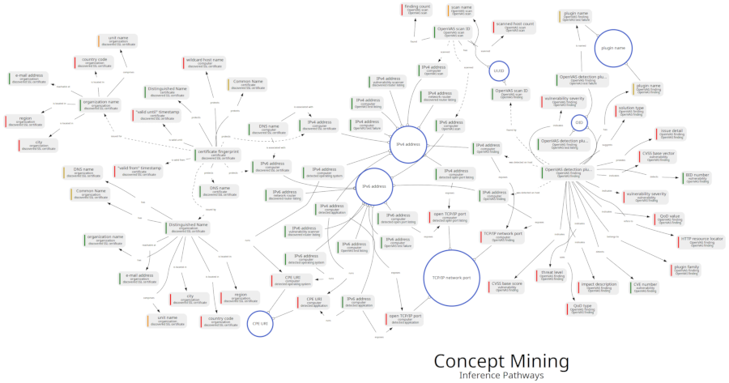

Data Transcoding
================

EDXML data is most commonly generated from some type of input data. The input data is used to generate output events. The EDXML SDK features the concept of a *record transcoder*, which is a class that contains all required information and logic for transcoding a chunk of input data into an output event. The SDK can use record transcoders to generate events and event type definitions for you. It also facilitates unit testing of record transcoders.

In case the input data transforms into events of more than one event type, the transcoding process can be done my multiple record transcoders. This allows splitting the problem of transcoding the input in multiple parts. A *transcoder mediator* can be used to automatically route chunks of input data to the correct transcoder.

A record transcoder is an extension of the :doc:`EventTypeFactory <event_type_factory>` class. Because of this, record transcoders use class constants to describe event types. These class constants will be used to populate the output ontology while transcoding.

All record transcoders feature a :attr:`TYPE_MAP <edxml.transcode.RecordTranscoder.TYPE_MAP>` constant which maps record selectors to event types. Record selectors identify chunks of input data that should transcode into a specific type of output event. What these selectors look like depends on the type of input data.

Object Transcoding
------------------

The most broadly usable record transcoder is the :class:`ObjectTranscoder <edxml.transcode.object.ObjectTranscoder>` class. Have a look at a quick example:

.. literalinclude:: ../edxml/examples/transcoder_object.py
  :language: Python

This minimal example shows a basic transcoder for input data records representing a user account. It shows the general structure of a transcoder, how to map input record types to output event types and map input record fields to output event properties.

The record selector shown in the :attr:`TYPE_MAP <edxml.transcode.RecordTranscoder.TYPE_MAP>` constant is simply the name of type of input record: ``user``. We will show how to label input records and how input record types are used to route input records to record transcoders later, when we discuss transcoder mediators.

The :attr:`PROPERTY_MAP <edxml.transcode.RecordTranscoder.PROPERTY_MAP>` constant maps input record fields to event type properties. Just one field-to-property mapping is shown here, extending the example is straight forward.

The :attr:`TYPE_PROPERTIES <edxml.ontology.EventTypeFactory.TYPE_PROPERTIES>` constant specifies the properties for each event type as well as the object type of each property. The object type that we refer to here using the ``ComputingBrick.OBJECT_USER_NAME`` constant is defined using an :doc:`ontology brick <bricks>` from the `public collection of ontology bricks <https://github.com/edxml/bricks>`_.

Transcoding Steps
^^^^^^^^^^^^^^^^^

What happens when the :func:`generate() <edxml.transcode.RecordTranscoder.generate()>` method of the transcoder is called is the following:

1. It will first generate an :doc:`ontology <ontology>` using the :attr:`TYPES <edxml.ontology.EventTypeFactory.TYPES>` constant to determine which event types to define and using the :attr:`PROPERTY_MAP <edxml.transcode.RecordTranscoder.PROPERTY_MAP>` constant to look up which properties each event type should have. From the :attr:`TYPE_PROPERTIES <edxml.ontology.EventTypeFactory.TYPE_PROPERTIES>` constant it determines the object types for each event property. In this example we have just one output event type which has a single property.
2. The transcoder will check the :attr:`TYPE_MAP <edxml.transcode.RecordTranscoder.TYPE_MAP>` constant and see that an input record of type ``user`` should yield an output event of type ``com.acme.staff.account``.
3. It checks the :attr:`PROPERTY_MAP <edxml.transcode.RecordTranscoder.PROPERTY_MAP>` constant to see which record fields it should read and which property its values should be stored in. In this example, the ``name`` field goes into the ``user.name`` property.
4. The transcoder reads the ``name`` field from the input record and uses it to populate the ``user.name`` property.

Input Record Fields
^^^^^^^^^^^^^^^^^^^

We referred to ``name`` as a "field" because we did not specify what ``name`` refers to. Each input record might be a Python object and a field might actually be an attribute of the input record. Or the record might be a dictionary and the field a key in that dictionary. Both scenarios are supported. The transcoder will first try to treat the record as a dictionary and use its ``get()`` method to read the ``name`` item. In our example, the record is not a dictionary and the read will fail. Then, the transcoder will try to see if the record has an attribute named ``name`` by attempting to read it using the ``getattr()`` method. This will succeed and the output event property is populated.

Object Types and Concepts
^^^^^^^^^^^^^^^^^^^^^^^^^

Record transcoders usually define only event types, not the object types and concepts that these event types refer to. The reason is that these ontology elements are rarely specific for one particular transcoder. Object types and concepts are typically used my multiple transcoders and multiple data sources. In fact, object types and concepts are the very thing that enable machines to correlate information from multiple EDXML documents and forge it into a single consistent data set.

For that reason object types and concepts are usually defined by means of :doc:`ontology bricks <bricks>` rather than a transcoder.

Selector Syntax
^^^^^^^^^^^^^^^

As we mentioned before, the ``name`` value in the :attr:`PROPERTY_MAP <edxml.transcode.RecordTranscoder.PROPERTY_MAP>` constant is not just a name. It is a selector. As such, it can point to more than just dictionary entries or attributes in input records. Selectors support a dotted syntax to address values within values. For example, ``foo.bar`` can be used to access an item named ``bar`` inside a dictionary named ``foo``. And if ``bar`` happens to be a list, you can address the first entry in that list by using ``foo.bar.0`` as selector.

Using a Mediator
^^^^^^^^^^^^^^^^

Now we will extend the example to include a transcoder mediator:

.. literalinclude:: ../edxml/examples/transcoder_object_mediator.py
  :language: Python

Now we see that the :attr:`TYPE_FIELD <edxml.transcode.object.ObjectTranscoderMediator.TYPE_FIELD>` constant of the mediator is used to set the name of the field in the input records that contains the record type. The example uses a single type of input record named `user`. The record transcoder is registered with the mediator using the same record type name. When the record is fed to the mediator using the :func:`process() <edxml.transcode.TranscoderMediator.process()>` method the mediator will read the record type and use the associated transcoder to generate an output event. In this case the output EDXML stream will be written to standard output. Note that the transcoder produces binary data, so we write the output to ``sys.stdout.buffer`` rather than ``sys.stdout``.

XML Transcoding
---------------

When you need to transcode XML input you can use the :class:`XmlTranscoder <edxml.transcode.xml.XmlTranscoder>` class. It is highly similar to the :class:`ObjectTranscoder <edxml.transcode.object.ObjectTranscoder>` class. The main difference is in how input records and fields are identified. This is done using XPath expressions. Below example illustrates this:

.. literalinclude:: ../edxml/examples/transcoder_xml_mediator.py
  :language: Python

XPath expressions are used in various places in the above example. Firstly, the transcoder is registered to transcode all XML elements that are found using XPath expression ``/records/users/user``. These will be treated as input records for the transcoding process. Note that transcoders should be registered using absolute XPath expressions. Second, the :attr:`TYPE_MAP <edxml.transcode.RecordTranscoder.TYPE_MAP>` constant indicates that all of the matching elements should be used for outputting an event of type ``com.acme.staff.account``. This is achieved by using an XPath expression relative to the root of the input element. In our example the entire input element becomes the output event, so we use ``.`` as the XPath expression. In case the transcoder would produce various types of output events from sub-elements, then the XPath expressions in :attr:`TYPE_MAP <edxml.transcode.RecordTranscoder.TYPE_MAP>` would need to select various sub-elements. Finally, the :attr:`PROPERTY_MAP <edxml.transcode.RecordTranscoder.PROPERTY_MAP>` constant indicates that the event property named ``user.name`` should be populated by applying XPath expression ``name`` to the input record. This ultimately results in a single output event containing object value ``Alice``.

Efficiency Considerations
^^^^^^^^^^^^^^^^^^^^^^^^^

The XML input is parsed in an incremental fashion. An in memory tree is built while parsing. For reasons of efficiency, the mediator will delete XML elements after transcoding them, thus preventing the in memory XML tree from growing while parsing. However, XML elements that have no matching transcoder are *not* deleted. The reason is that XML transcoders may need to aggregate information from multiple XML elements, while being registered on just one of those elements. So, the in memory XML tree may still grow when parts of the document have no transcoder associated with them.

The solution is to use the :class:`NullTranscoder <edxml.transcode.NullTranscoder>`. Registering this transcoder with an absolute XPath selector will allow the mediator to delete the matching XML elements and keep the in memory tree nice and clean.

Advanced Subjects
-----------------

Defining Event Sources
^^^^^^^^^^^^^^^^^^^^^^

The transcoder mediator examples showed how to add and select an event source for the output events. This will suffice for cases where the transcoder presents its output as a single EDXML event source. Transcoders may also define and use multiple EDXML event sources. This can be done by defining multiple sources and switch sources while feeding input records. For advanced use cases there are other methods that may suit you better.

Defining event sources can also be done by overriding the :func:`generate_ontology() <edxml.ontology.EventTypeFactory.generate_ontology>` method.

Assigning an event source to individual output events can be done by overriding the :func:`post_process() <edxml.transcode.RecordTranscoder.post_process>` method. This is described in more detail :ref:`here <custom-event>`.

Outputting Multiple Events
^^^^^^^^^^^^^^^^^^^^^^^^^^

By default, the transcoding process produces a single EDXML output event for each input data record. When input records contain a lot of information it may make sense to transcode a single input record into multiple output events. This can be achieved by overriding the :func:`post_process() <edxml.transcode.RecordTranscoder.post_process>` function. This is explained in more detail in the next subsection.

.. _custom-event:

Customizing Output Events
^^^^^^^^^^^^^^^^^^^^^^^^^

The events that are generated by the transcoder may be all you need for simple use cases. Sometimes the events may require additional processing. For example, you might need to adjust the values for some property. As an example, let us assume that the object values for some property need to be converted to lowercase. This can be done by defining the following generator:

.. code-block:: python

    def lowercase_user_name(name):
        yield name.lower()

Then, this generator can be used in the :attr:`TYPE_PROPERTY_POST_PROCESSORS <edxml.transcode.RecordTranscoder.TYPE_PROPERTY_POST_PROCESSORS>` constant:

.. code-block:: python

    TYPE_PROPERTY_POST_PROCESSORS = {
        'com.acme.staff.account': {
            'user': lowercase_user_name,
        }
    }

Note that the postprocessor can also be used to generate multiple object values from a single input record value.

If you need full access to the generated events and adjust them to your liking, then you can override the :func:`post_process() <edxml.transcode.RecordTranscoder.post_process>` function. This function is actually a generator taking a single EDXML event as input and generating zero or more output events. The input record from which the event was constructed is provided as a function argument as well.

As an example, you might want to add the original JSON input record as an event attachment. An implementation of this could look like the following:

.. code-block:: python

    def post_process(self, event, input_record):
        event.attachments['input-record']['input-record'] = json.dumps(input_record)
        yield event

.. _custom-ontology:

Customizing the Ontology
^^^^^^^^^^^^^^^^^^^^^^^^

Not every aspect of the output ontology can be specified by means of the record transcoder class constants. Defining property relations is an example of this. Property relations are much better expressed in a procedural fashion. This can be done by overriding the :func:`create_event_type() <edxml.ontology.EventTypeFactory.create_event_type>` class method. This is demonstrated in the following example:

.. code-block:: python

    @classmethod
    def create_event_type(cls, event_type_name, ontology):

        user = super().create_event_type(event_type_name, ontology)

        user['name'].relate_intra('can be reached at', 'phone').because(
            "the LDAP directory entry of [[name]] mentions [[phone]]"
        )

        return user

Unit Testing
^^^^^^^^^^^^

Record transcoders can be tested using a transcoder test harness. This is a special kind of transcoder mediator. There is the :class:`TranscoderTestHarness <edxml.transcode.TranscoderTestHarness>` base class and the :class:`ObjectTranscoderTestHarness <edxml.transcode.object.ObjectTranscoderTestHarness>` and :class:`XmlTranscoderTestHarness <edxml.transcode.xml.XmlTranscoderTestHarness>` extensions. Feeding input records into these mediators will have the test harness use your transcoder to generate an EDXML document containing the output ontology and events, validating the output in the process. The EDXML document will then be parsed back into Python objects. The data is validated again in the process. Finally, any colliding events will be merged and the final event collection will be validated a third time. This assures that the output of the transcoder can be serialized into EDXML, deserialized and merged correctly.

After feeding the input records the parsed ontology and events are exposed by means of the :attr:`events <edxml.transcode.TranscoderTestHarness.events>` attribute of the test harness. This attribute is an :class:`EventCollection <edxml.EventCollection>` which you can use to write assertions about the resulting ontology and events. So, provided you feed the test harness with a good set of test records, this results in unit tests that cover everything. The transcoding process itself, ontology generation, validity of the output events and event merging logic.

A full example of the use of a test harness is shown below:

.. literalinclude:: ../edxml/examples/transcoder_harness.py
  :language: Python

Automatic Data Normalization and Cleaning
^^^^^^^^^^^^^^^^^^^^^^^^^^^^^^^^^^^^^^^^^

By default a transcoder will just copy values from the input records into the properties of the output events. Often times this will not yield the desired result. A common case is date / time values. There are many different formats for representing time, and EDXML accepts just one specific format. Even greater challenges arise when the types of values contained in a single input record field may vary from one input record to another. Or when an input record field may occasionally contain downright nonsensical gibberish.

Transcoders feature various means of dealing with these challenges. Input data can be automatically normalized and cleaned. The default transcoder behavior is to error when it produces an event containing an invalid object value. In stead of adding code to properly normalize event object values in your transcoders, you can also have the SDK do the normalization for you. In order to do so you can use the :attr:`TYPE_AUTO_REPAIR_NORMALIZE <edxml.transcode.RecordTranscoder.TYPE_AUTO_REPAIR_NORMALIZE>` constant to opt into automatic normalization for a particular event property.

Automatic normalization also supports events containing non-string values. For example, placing a float in a property that uses an EDXML data type from the decimal family can automatically normalize that float into the proper decimal string representation that fits the data type. Some of the supported Python types are float, bool, datetime, Decimal and IP (from `IPy <https://pypi.org/project/IPy/>`_).

In some cases, input data may contain values that cannot be normalized automatically. Using the :attr:`TYPE_AUTO_REPAIR_DROP <edxml.transcode.RecordTranscoder.TYPE_AUTO_REPAIR_DROP>` constant it is possible to opt into dropping these values from the output event. A common case is an input record that contains a field that may hold both IPv4 and IPv6 internet addresses. In EDXML these must be represented using different data types and separate event properties. This can be done by having the transcoder store the value in both properties. This means that one of the two properties will always contain an invalid value. By allowing these invalid values to be dropped, the output events will always have the values in the correct event property.

Note that there can be quite a performance penalty for enabling automatic normalization and cleaning. In many cases, this will not matter much. The transcoder is optimistic. As long as the output events are valid no normalization or cleaning done and there is no performance hit. Only when an output event fails to validate the expensive event repair code is run.

In case performance turns out to be an issue, you can always optimize your transcoder by normalizing event objects yourself. You might find the :attr:`TYPE_PROPERTY_POST_PROCESSORS <edxml.transcode.RecordTranscoder.TYPE_PROPERTY_POST_PROCESSORS>` constant helpful. Alternatively, you can override the :func:`post_process() <edxml.transcode.RecordTranscoder.post_process>` function to modify the autogenerated events as needed.

In case you want to retain the original record values as they were before normalization and cleaning there are two options for doing so. Firstly, the original value could be stored in another property and an 'original' relations could be used to relate the original value to the normalized one. Second, (part of) the original input record could be stored as an event attachment.

Description & Visualization
^^^^^^^^^^^^^^^^^^^^^^^^^^^

The `Transcoder Mediator`_ class contains two methods that allows EDXML transcoders to generate descriptions and visualizations of their output ontology. Both can be great aids to review the ontology information in your record transcoders. The first of these methods is :func:`describe_transcoder() <edxml.transcode.TranscoderMediator.describe_transcoder>`. Refer to that method for details. The other method is :func:`generate_graphviz_concept_relations() <edxml.transcode.TranscoderMediator.generate_graphviz_concept_relations>`. Again, refer to that method for details.

The image displayed below shows an example of the output of :func:`generate_graphviz_concept_relations() <edxml.transcode.TranscoderMediator.generate_graphviz_concept_relations>` for an advanced transcoder that employs multiple record transcoders:

The image shows the various reasoning pathways for :doc:`concept mining <mining>` provided by the full ontology of all record transcoders combined. It tells the transcoder developer how machines can correlate information to mine knowledge from the data.

API Documentation
-----------------

Below, the documentation of the various transcoding classes is given.

*Base Classes*

- `Record Transcoder`_
- `Transcoder Mediator`_
- `Transcoder Test Harness`_

*Transcoders & Mediators*

- `Object Transcoder`_
- `Object Transcoder Mediator`_
- `XML Transcoder`_
- `XML Transcoder Mediator`_

*Test Harnesses*

- `Object Transcoder Test Harness`_
- `XML Transcoder Test Harness`_

RecordTranscoder
^^^^^^^^^^^^^^^^
.. _`Record Transcoder`:

.. autoclass:: edxml.transcode.RecordTranscoder
    :members:
    :show-inheritance:

TranscoderMediator
^^^^^^^^^^^^^^^^^^
.. _`Transcoder Mediator`:

.. autoclass:: edxml.transcode.TranscoderMediator
    :members:
    :show-inheritance:

TranscoderTestHarness
^^^^^^^^^^^^^^^^^^^^^
.. _`Transcoder Test Harness`:

.. autoclass:: edxml.transcode.TranscoderTestHarness
    :members:
    :show-inheritance:

ObjectTranscoder
^^^^^^^^^^^^^^^^
.. _`Object Transcoder`:

.. autoclass:: edxml.transcode.object.ObjectTranscoder
    :members:
    :show-inheritance:

ObjectTranscoderMediator
^^^^^^^^^^^^^^^^^^^^^^^^
.. _`Object Transcoder Mediator`:

.. autoclass:: edxml.transcode.object.ObjectTranscoderMediator
    :members:
    :show-inheritance:

XmlTranscoder
^^^^^^^^^^^^^
.. _`XML Transcoder`:

.. autoclass:: edxml.transcode.xml.XmlTranscoder
    :members:
    :show-inheritance:

XmlTranscoderMediator
^^^^^^^^^^^^^^^^^^^^^
.. _`XML Transcoder Mediator`:

.. autoclass:: edxml.transcode.xml.XmlTranscoderMediator
    :members:
    :show-inheritance:

ObjectTranscoderTestHarness
^^^^^^^^^^^^^^^^^^^^^^^^^^^
.. _`Object Transcoder Test Harness`:

.. autoclass:: edxml.transcode.object.ObjectTranscoderTestHarness
    :members:
    :show-inheritance:

XmlTranscoderTestHarness
^^^^^^^^^^^^^^^^^^^^^^^^
.. _`XML Transcoder Test Harness`:

.. autoclass:: edxml.transcode.xml.XmlTranscoderTestHarness
    :members:
    :show-inheritance:

NullTranscoder
^^^^^^^^^^^^^^
.. _`Null Transcoder`:

.. autoclass:: edxml.transcode.NullTranscoder
    :members:
    :show-inheritance:
